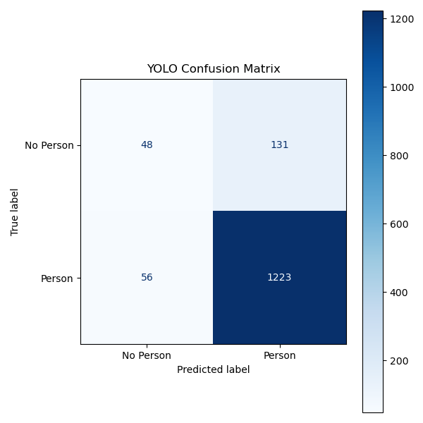
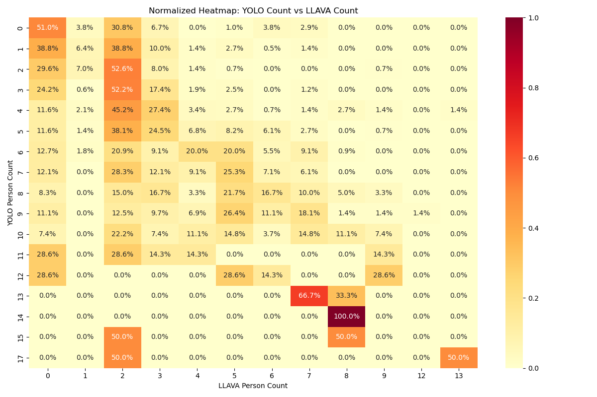

# Master Thesis — Ambiguous Pedestrian Detection in Urban Environments

## 🧩 Overview
This repository contains the implementation and experimental analysis for my Master's Thesis on **ambiguous pedestrian detection** in autonomous driving contexts.  
The project compares **YOLOv8** (object detection) and **LLaVA** (multimodal reasoning) to analyze how well each model handles **ambiguous or fake pedestrians** in complex urban scenes.

---

## 🚀 Project Pipeline
1. **Dataset creation**  
   - Collected original GoPro recordings (mounted on a car).  
   - Extracted frames every 10 seconds using `extraireframe.py`.  
   - Combined with two online pedestrian videos and the **University of Sydney pedestrian dataset**.

2. **Manual annotation**  
   - Used a Tkinter-based selection interface (`selection.py`) to label frames containing real and fake pedestrians.  
   - Produced `ground_truth_csv` files.

3. **YOLOv8 detection**  
   - Run detection via `run_yolo_detection.py` and `real-time-yolo.py`.  
   - Saved results in `YOLO-RESULTS/` and aggregated metrics in `yolo_results.csv`.

4. **LLaVA analysis**  
   - Performed contextual reasoning using `LLAVAselectiontheone.py`.  
   - Generated JSON descriptions and confidence metrics stored in `LLAVA-RESULTS/`.

5. **Result merging and evaluation**  
   - Combined YOLO and LLaVA outputs with `merged_results.csv`.  
   - Computed evaluation metrics and visualized confusion matrices and heatmaps using `final-conclusion.py`.

---

## 📂 Project Structure
master-thesis-pedestrian-ambiguity/
├── src/ # All Python scripts
├── data/ # Processed data and intermediate results
├── results/ # Final CSVs and visualizations
└── README.md

---

## 🧠 Technologies Used
- **Python 3.10**
- **YOLOv8** (Ultralytics)
- **LLaVA** (Large Language and Vision Assistant)
- **OpenCV**, **Tkinter**, **Pandas**, **Matplotlib**, **JSON**
- **Jupyter Notebooks** for analysis

---

## 📊 Key Results
- Comparison of YOLOv8 vs LLaVA on ambiguous pedestrian detection.  
- Heatmaps and confusion matrices showing model strengths and weaknesses.  
- Final metrics stored in `results/conclusion/summary_metrics.csv`.

Example visualizations:

| YOLOv8 Confusion Matrix | LLaVA Confusion Matrix | YOLO vs LLaVA Heatmap |
|:------------------------:|:---------------------:|:---------------------:|
|  |  |  |

---

## 📘 Citation
If you wish to reference or reuse this work, please cite it as:
> *[Your Name]*, "Ambiguous Pedestrian Detection in Urban Environments", Master's Thesis, 2025.

---

## 👤 Author
**BENMOHRA SERINE**  
Master’s in Artificial Intelligence — 2025  
[LinkedIn](www.linkedin.com/in/serine-benmohra-55715b33b) | [Portfolio](#) | [GitHub](#)
# master-thesis-pedestrian-ambiguity
