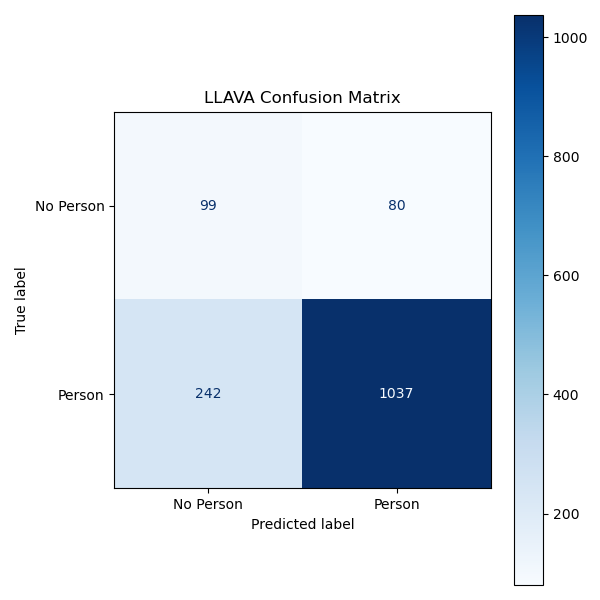

# 🚶 Pedestrian Detection in Autonomous Driving using YOLOv8 & LLAVA

[](https://www.python.org/)
[](https://opencv.org/)
[](https://www.linkedin.com/in/serineben/)

This project is part of my **Master Thesis** 🎓. It focuses on detecting pedestrians in urban driving scenes using **YOLOv8** and **LLAVA**, handling ambiguous cases such as partially visible or occluded pedestrians.

---

## 📂 Repository Structure

master-thesis-pedestrian-ambiguity/
├── data/
│ └── dataset_person_summary.csv # Summary CSV only (full dataset not included)
├── src/
│ ├── extraireframe.py # Frame extraction
│ ├── image_selection.py # Manual frame selection GUI
│ ├── run_yolo_detection.py # YOLOv8 detection
│ ├── real-time-yolo.py # Real-time YOLO demo
│ └── LLAVAselectiontheone.py # LLAVA scene analysis
├── results/
│ ├── pipeline.png # Project pipeline diagram
│ ├── false_positive1.jpg # Example false positive
│ ├── false_positive2.jpg # Example false positive
│ └── conclusion/
│ ├── YOLO_confusion_matrix.png
│ ├── LLAVA_confusion_matrix.png
│ ├── heatmap_yolo_vs_llava.png
│ └── summary_metrics.csv
├── README.md
└── merged_results.csv


> ⚠️ Full datasets and complete results are not included due to size constraints.

---

## 🛠 Pipeline


1. 🎬 Extract frames from videos.  
2. 👁️ Manually select frames with pedestrians.  
3. 🤖 Detect pedestrians using YOLOv8.  
4. 🔍 Analyze scenes with LLAVA.  
5. 📊 Evaluate results with confusion matrices & heatmaps.

---

## 📊 Results Examples

### ❌ False Positives

Examples of YOLOv8 mistakes:


### 📈 Confusion Matrices & Heatmap





---

## ⚙ How to Run

```bash
python src/extraireframe.py
python src/image_selection.py
python src/run_yolo_detection.py
python src/LLAVAselectiontheone.py
python src/final-conclusion.py


