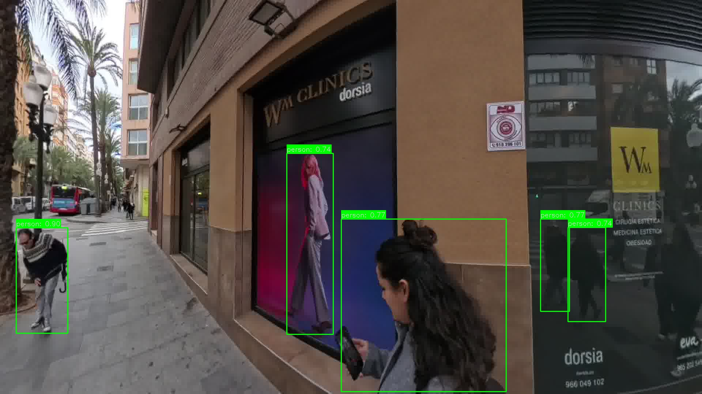
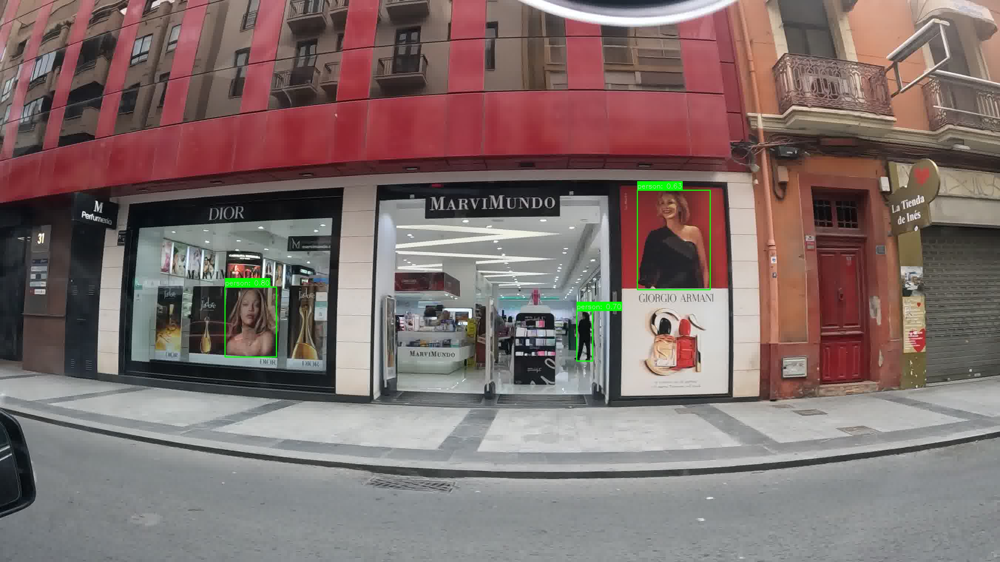

# 🚶 Pedestrian Detection in Autonomous Driving using YOLOv8 & LLaVA

[](https://www.python.org/)
[](https://opencv.org/)
[](https://www.linkedin.com/in/serine-benmohra-55715b33b)
[](LICENSE)

This Master's Thesis project explores advanced pedestrian detection in urban driving scenarios using **YOLOv8** and **LLaVA**. The research focuses on handling challenging cases such as partial visibility, occlusions, and ambiguous pedestrian appearances to enhance autonomous driving safety.

---

## 📖 Abstract

Pedestrian detection remains a critical challenge in autonomous driving systems, particularly in complex urban environments. This thesis investigates the integration of **YOLOv8** for real-time object detection and **LLaVA** (Large Language-and-Vision Assistant) for contextual scene understanding to improve detection accuracy in ambiguous scenarios. The proposed approach demonstrates enhanced performance in identifying partially visible and occluded pedestrians compared to traditional methods.

---

## 📂 Repository Structure
```bash
master-thesis-pedestrian-ambiguity/
├── 📊 data/
│   └── dataset_person_summary.csv
├── 🔧 src/
│   ├── extraireframe.py
│   ├── image_selection.py
│   ├── run_yolo_detection.py
│   ├── real-time-yolo.py
│   └── LLAVAselectiontheone.py
├── 📈 results/
│   ├── pipeline.png
│   ├── false_positive1.jpg
│   ├── false_positive2.jpg
│   └── conclusion/
│       ├── YOLO_confusion_matrix.png
│       ├── LLAVA_confusion_matrix.png
│       ├── heatmap_yolo_vs_llava.png
│       └── summary_metrics.csv
├── 📄 thesis/
│   └── master_thesis_document.pdf
├── README.md
└── requirements.txt
```
> Note: Full datasets and extensive results are not included due to size constraints. Contact me for access to complete research materials.

---
**🛠️ Methodology**

**Pipeline Overview**


🎬 Frame Extraction - Extract relevant frames from driving scenario videos

👁️ Manual Curation - Select frames containing pedestrians using interactive GUI

🤖 YOLOv8 Detection - Perform initial pedestrian detection using YOLOv8

🔍 LLaVA Analysis - Apply vision-language model for contextual understanding

📊 Comparative Evaluation - Analyze results using confusion matrices and heatmaps

---

## 📊 Key Results

### Detection Performance

The combined YOLOv8 + LLaVA approach shows significant improvement in handling ambiguous cases:

*Reduced false positives* in complex urban scenes

*Enhanced detection* of partially visible pedestrians

*Better contextual* understanding of occluded scenarios

**❌ False Positive Analysis**
Examples where YOLOv8 alone produces incorrect detections:

 
**📈 Performance Metrics**
Comparative analysis of YOLOv8 and LLaVA performance:

  

---
### ⚙️ Installation & Usage
**Prerequisites**
```bash
# Clone repository
git clone https://github.com/yourusername/master-thesis-pedestrian-ambiguity.git
cd master-thesis-pedestrian-ambiguity

# Install dependencies
pip install -r requirements.txt 
```

**Execution Pipeline** 
```bash
# Run the complete analysis pipeline
python src/extract_frames.py
python src/image_selection.py
python src/run_yolo_detection.py
python src/llava_analysis.py
python src/analyze_results.py

# For real-time demonstration
python src/real_time_yolo.py
```

**👨‍🎓 Author**
Serine Benmohra
Master's Student in Computer Science/Artificial Intelligence
[https://img.shields.io/badge/LinkedIn-Connect-blue?logo=linkedin](https://www.linkedin.com/in/serine-benmohra-55715b33b)
This project represents my Master's Thesis research in Universidad de Alicante.

**📝 Citation**
If you use this work in your research, please cite:
```bash
@mastersthesis{benmohra2025pedestrian,
  title={Pedestrian Detection in Autonomous Driving using YOLOv8 and LLaVA},
  author={Benmohra, Serine},
  year={2025},
  school={Universidad de Alicante}
}
```


