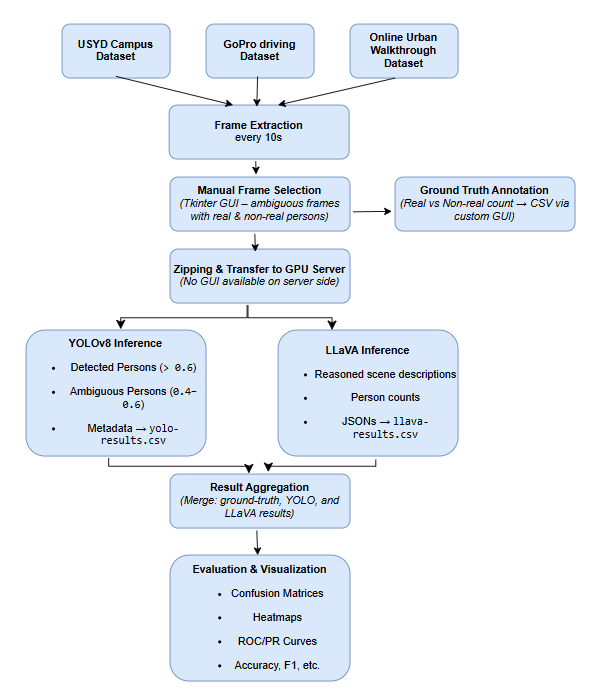

# 🚶 Pedestrian Detection in Autonomous Driving using YOLOv8 & LLaVA

[](https://www.python.org/)
[](https://opencv.org/)
[](https://www.linkedin.com/in/serine-benmohra-55715b33b)
[](LICENSE)

This Master's Thesis project explores advanced pedestrian detection in urban driving scenarios using **YOLOv8** and **LLaVA**. The research focuses on handling challenging cases such as partial visibility, occlusions, and ambiguous pedestrian appearances to enhance autonomous driving safety.

---

## 📖 Abstract

Pedestrian detection remains a critical challenge in autonomous driving systems, particularly in complex urban environments. This thesis investigates the integration of **YOLOv8** for real-time object detection and **LLaVA** (Large Language-and-Vision Assistant) for contextual scene understanding to improve detection accuracy in ambiguous scenarios. The proposed approach demonstrates enhanced performance in identifying partially visible and occluded pedestrians compared to traditional methods.

---

## 📂 Repository Structure

master-thesis-pedestrian-ambiguity/
├── 📊 data/
│   └── dataset_person_summary.csv
├── 🔧 src/
│   ├── extraireframe.py
│   ├── image_selection.py
│   ├── run_yolo_detection.py
│   ├── real-time-yolo.py
│   └── LLAVAselectiontheone.py
├── 📈 results/
│   ├── pipeline.png
│   ├── false_positive1.jpg
│   ├── false_positive2.jpg
│   └── conclusion/
│       ├── YOLO_confusion_matrix.png
│       ├── LLAVA_confusion_matrix.png
│       ├── heatmap_yolo_vs_llava.png
│       └── summary_metrics.csv
├── 📄 thesis/
│   └── master_thesis_document.pdf
├── README.md
└── requirements.txt

> ⚠️ Full datasets and complete results are not included due to size constraints.

---

## 🛠 Pipeline



1. 🎬 Extract frames from videos.  
2. 👁️ Manually select frames with pedestrians.  
3. 🤖 Detect pedestrians using YOLOv8.  
4. 🔍 Analyze scenes with LLAVA.  
5. 📊 Evaluate results with confusion matrices & heatmaps.

---

## 📊 Results Examples

### ❌ False Positives

Examples of YOLOv8 mistakes:


### 📈 Confusion Matrices & Heatmap


---

## ⚙ How to Run

```bash
python src/extract_frames.py
python src/image_selection.py
python src/run_yolo_detection.py
python src/llava_analysis.py
python src/analyze_results.py


